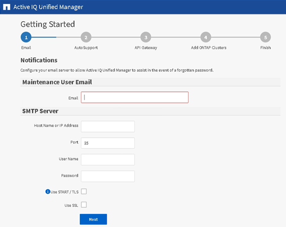

= Unified Manager 웹 UI의 초기 설정 수행
:icons: font
:imagesdir: ../media/

[role="lead"]
Unified Manager를 사용하려면 먼저 NTP 서버, 유지보수 사용자 이메일 주소, SMTP 서버 호스트 및 ONTAP 클러스터 추가를 포함한 초기 설정 옵션을 구성해야 합니다.

* 필요한 것 *

다음 작업을 수행해야 합니다.

* 설치 후 제공된 URL을 사용하여 Unified Manager 웹 UI를 실행했습니다
* 설치 중에 생성된 유지보수 사용자 이름 및 암호(Linux 설치의 경우 umadmin 사용자)를 사용하여 로그인했습니다

Active IQ Unified Manager 시작 페이지는 웹 UI에 처음 액세스할 때만 나타납니다. 아래 페이지는 VMware 설치 페이지입니다.

나중에 이 옵션 중 하나를 변경하려면 Unified Manager의 왼쪽 탐색 창에서 일반 옵션에서 원하는 옵션을 선택합니다. NTP 설정은 VMware 설치에만 해당되며 나중에 Unified Manager 유지보수 콘솔을 사용하여 변경할 수 있습니다.

.단계
. Active IQ Unified Manager 초기 설정 페이지에서 유지보수 사용자 e-메일 주소, SMTP 서버 호스트 이름 및 추가 SMTP 옵션, NTP 서버(VMware 설치만 해당)를 입력합니다. 그런 다음 * 계속 * 을 클릭합니다.
. AutoSupport 페이지에서 * 동의 및 계속 * 을 클릭하여 AutoSupport 메시지를 Unified Manager에서 NetAppActive IQ로 보낼 수 있습니다.
+
AutoSupport 콘텐츠를 전송하기 위해 인터넷 액세스를 제공할 프록시를 지정해야 하거나 AutoSupport를 비활성화하려면 웹 UI에서 * 일반 * > * AutoSupport * 옵션을 사용하십시오.

. Red Hat 및 CentOS 시스템에서 umadmin 사용자 암호를 기본 ""admin" 문자열에서 사용자 정의 문자열로 변경할 수 있습니다.
. API 게이트웨이 설정 페이지에서 ONTAP REST API를 사용하여 모니터링하려는 ONTAP 클러스터를 Unified Manager에서 관리할 수 있도록 하는 API 게이트웨이 기능을 사용할지 여부를 선택합니다. 그런 다음 * 계속 * 을 클릭합니다.
+
웹 UI의 나중에 * 일반 * > * 기능 설정 * > * API 게이트웨이 * 에서 이 설정을 활성화하거나 비활성화할 수 있습니다. API에 대한 자세한 내용은 를 참조하십시오 link:../api-automation/concept_get_started_with_um_apis.html["Active IQ Unified Manager API 개발자 가이드 를 참조하십시오"].

. Unified Manager에서 관리할 클러스터를 추가하고 * 다음 * 을 클릭합니다. 관리하려는 각 클러스터마다 사용자 이름 및 암호 자격 증명과 함께 호스트 이름 또는 클러스터 관리 IP 주소(IPv4 또는 IPv6)가 있어야 합니다. 사용자는 ""admin" 역할을 가지고 있어야 합니다.
+
이 단계는 선택 사항입니다. 웹 UI의 나중에 * 스토리지 관리 * > * 클러스터 설정 * 에서 클러스터를 추가할 수 있습니다.

. 요약 페이지에서 모든 설정이 올바른지 확인하고 * 마침 * 을 클릭합니다.

시작하기 페이지가 닫히고 Unified Manager 대시보드 페이지가 표시됩니다.
