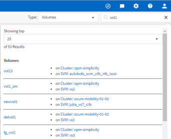

= 스토리지 객체를 검색하는 중입니다
:icons: font
:imagesdir: ../media/

[role="lead"]
특정 개체에 빠르게 액세스하려면 메뉴 모음 맨 위에 있는 * 모든 스토리지 개체 검색 * 필드를 사용합니다. 모든 개체에 대해 이 전역 검색 방법을 사용하면 유형별로 특정 개체를 빠르게 찾을 수 있습니다. 검색 결과는 스토리지 객체 유형별로 정렬되며 드롭다운 메뉴를 사용하여 필터링할 수 있습니다. 유효한 검색에는 3자 이상의 문자가 포함되어야 합니다.

전체 검색에는 총 결과 수가 표시되지만 상위 25개 검색 결과만 액세스할 수 있습니다. 따라서 빠르게 찾을 항목을 알고 있으면 전역 검색 기능을 특정 항목을 찾는 바로 가기 도구로 생각할 수 있습니다. 전체 검색 결과의 경우 객체 재고 페이지 및 관련 필터링 기능을 사용하여 검색할 수 있습니다.

드롭다운 상자를 클릭하고 * All * 을 선택하여 모든 오브젝트 및 이벤트를 동시에 검색할 수 있습니다. 또는 드롭다운 상자를 클릭하여 개체 유형을 지정할 수 있습니다. 모든 스토리지 객체 검색 * 필드에 객체 또는 이벤트 이름의 최소 3자를 입력한 다음 * Enter * 를 눌러 다음과 같은 검색 결과를 표시합니다.

* 클러스터:클러스터 이름
* 노드:노드 이름
* 애그리게이트: 애그리게이트 이름
* SVM: SVM 이름
* 볼륨: 볼륨 이름
* LUN: LUN 경로

[NOTE]
====
LIF 및 포트는 글로벌 검색 창에서 검색할 수 없습니다.

====
이 예제에서 드롭다운 상자에는 볼륨 개체 유형이 선택되어 있습니다. Search All Storage Objects * 필드에 ""vol""을 입력하면 이름에 해당 문자가 포함된 모든 볼륨 목록이 표시됩니다. 개체 검색의 경우 검색 결과를 클릭하여 해당 개체의 성능 탐색기 페이지로 이동할 수 있습니다. 이벤트 검색의 경우 검색 결과에서 항목을 클릭하면 이벤트 세부 정보 페이지로 이동합니다.
