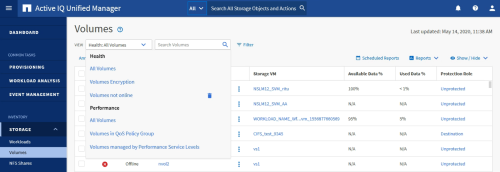

= 보기 및 보고서 관계 이해
:allow-uri-read: 
:icons: font
:imagesdir: ../media/

[role="lead"]
보기 및 인벤토리 페이지는 다운로드하거나 예약할 때 보고서가 됩니다.

다시 사용할 보기 및 인벤토리 페이지를 사용자 지정하고 저장할 수 있습니다. Unified Manager에서 볼 수 있는 거의 모든 기능을 저장, 재사용, 사용자 지정, 예약 및 보고서로 공유할 수 있습니다.

보기 드롭다운에서 삭제 아이콘이 있는 항목은 사용자 또는 다른 사용자가 만든 기존 사용자 지정 보기입니다. 아이콘이 없는 항목은 Unified Manager와 함께 제공되는 기본 보기입니다. 기본 보기는 수정하거나 삭제할 수 없습니다.

[NOTE]
====
* 목록에서 사용자 지정 보기를 삭제하면 해당 보기를 사용하는 모든 Excel 파일 또는 예약된 보고서도 삭제됩니다.
* 사용자 정의 보기를 변경하면 해당 보기를 사용하는 보고서에는 다음에 보고서를 생성하고 보고서 일정에 따라 이메일로 전송할 때 변경 사항이 반영됩니다. 보기를 변경할 때 보고서에 사용된 Excel 사용자 지정 관련 변경 내용이 제대로 적용되었는지 확인합니다. 필요한 경우 Excel 파일을 다운로드하여 필요한 내용을 변경한 다음 보기에 대한 새 Excel 사용자 지정으로 업로드하여 업데이트할 수 있습니다.

====

애플리케이션 관리자 또는 스토리지 관리자 역할을 가진 사용자만 삭제 아이콘을 보거나, 보기를 변경 또는 삭제하거나, 예약된 보고서를 변경 또는 삭제할 수 있습니다.
