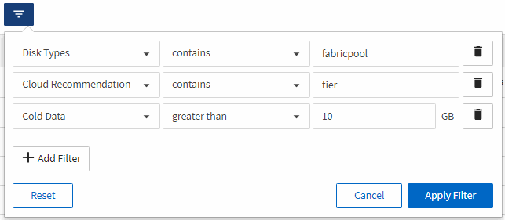

= 보고서를 생성하여 데이터를 클라우드 계층으로 이동해야 하는 FabricPool 애그리게이트에서 볼륨을 식별합니다
:allow-uri-read: 
:icons: font
:imagesdir: ../media/

[role="lead"]
현재 FabricPool 애그리게이트에 있는 볼륨 목록, 클라우드 권장 사항이 Tier인 볼륨 및 콜드 데이터가 많은 보고서를 생성할 수 있습니다. 이 보고서를 통해 특정 볼륨에 대한 계층화 정책을 ""자동"" 또는 ""모두""로 변경하여 더 많은 콜드(비활성) 데이터를 클라우드 계층으로 오프로드해야 할지 여부를 결정할 수 있습니다.

.시작하기 전에
* 애플리케이션 관리자 또는 스토리지 관리자 역할이 있어야 합니다.
* FabricPool 애그리게이트를 구성하고 해당 애그리게이트에 볼륨을 가지고 있어야 합니다.

아래 단계에 따라 필요한 열을 올바른 순서로 표시하는 사용자 지정 보기를 만든 다음 해당 보기에 대해 보고서를 생성하도록 예약합니다.

.단계
. 왼쪽 탐색 창에서 * 스토리지 * > * 볼륨 * 을 클릭합니다.
. 보기 메뉴에서 * 성능 * > * 모든 볼륨 * 을 선택합니다.
. 칼럼 선택기에서 "디스크 유형" 칼럼이 보기에 나타나는지 확인합니다.
+
보고서에 중요한 보기를 만들려면 다른 열을 추가하거나 제거합니다.

. "클라우드 권장 사항" 열 근처에 있는 "디스크 유형" 열을 끌어 놓습니다.
. 필터 아이콘을 클릭하고 다음 3개의 필터를 추가한 다음 * 필터 적용 * 을 클릭합니다.
+
** 디스크 유형에 FabricPool가 포함되어 있습니다
** 클라우드 권장에는 계층이 포함됩니다
** 콜드 데이터가 10GB보다 큽니다

. 콜드 데이터 열의 맨 위를 클릭하여 가장 차가운 데이터가 있는 볼륨이 보기의 맨 위에 표시되도록 합니다.
. 뷰에 표시되는 내용을 반영하는 이름으로 뷰를 저장합니다. 예를 들어 ""Vols change Tiering policy""를 사용할 수 있습니다.image:../media/report_vol_cold_data.gif["Vols CHANGE 계층화 정책 페이지가 표시되고 필요한 열이 올바른 순서로 표시되는 UI 스크린샷입니다."]
. 재고 페이지에서 * Scheduled Reports * 버튼을 클릭합니다.
. 새 보고서의 일정 특성을 정의할 수 있도록 [일정 추가] * 를 클릭하여 [보고서 일정] 페이지에 새 행을 추가합니다.
. 보고서 일정 이름을 입력하고 다른 보고서 필드를 입력한 다음 확인 표시(image:../media/blue_check.gif[""])를 클릭합니다.
+
보고서가 즉시 테스트로 전송됩니다. 그런 다음 보고서가 생성되어 지정된 빈도를 사용하여 나열된 수신자에게 전자 메일로 전송됩니다.

보고서에 표시된 결과에 따라 시스템 관리자 또는 ONTAP CLI를 사용하여 특정 볼륨에 대한 계층화 정책을 ""자동" 또는 ""모두""로 변경하여 더 많은 콜드 데이터를 클라우드 계층으로 오프로드할 수 있습니다.
