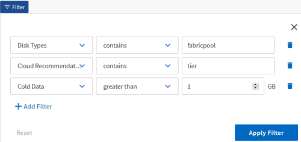

= 데이터 필터링
:icons: font
:imagesdir: ../media/

[role="lead"]
데이터를 필터링하여 결과가 보고서 요구 사항과 일치하는지 확인합니다. 필터링을 사용하면 원하는 데이터만 표시할 수 있습니다.

.단계
. 필터 아이콘을 클릭하여 보려는 결과에 초점을 맞출 필터를 추가한 다음 * 필터 적용 * 을 클릭합니다.
+

. 저장하지 않은 보기의 이름을 지정하여 변경 내용을 저장합니다.

