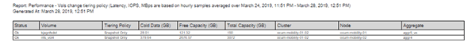

= 빠른 시작 보고
:allow-uri-read: 
:icons: font
:imagesdir: ../media/

[role="lead"]
보기 탐색 및 보고서 예약을 경험할 수 있는 샘플 사용자 지정 보고서를 만듭니다. 이 빠른 시작 보고서에서는 상당히 많은 양의 비활성(콜드) 데이터가 있으므로 클라우드 계층으로 이동할 수 있는 볼륨 목록을 찾습니다. Performance:All Volumes 보기를 열고, 필터와 열을 사용하여 보기를 사용자 지정하고, 사용자 지정 보기를 보고서로 저장하고, 보고서를 일주일에 한 번 공유하도록 예약합니다.

* 필요한 것 *

* 애플리케이션 관리자 또는 스토리지 관리자 역할이 있어야 합니다.
* FabricPool 애그리게이트를 구성하고 해당 애그리게이트에 볼륨을 가지고 있어야 합니다.

다음 단계를 수행하십시오.

* 기본 보기를 엽니다
* 데이터를 필터링하고 정렬하여 열을 사용자 지정합니다
* 뷰를 저장합니다
* 사용자 정의 보기에 대해 생성할 보고서를 예약합니다

.단계
. 왼쪽 탐색 창에서 * 스토리지 * > * 볼륨 * 을 클릭합니다.
. 보기 메뉴에서 * 성능 * > * 모든 볼륨 * 을 선택합니다.
. Show/Hide * (표시/숨기기 *)를 클릭하여 보기에 "디스크 유형" 열이 나타나는지 확인합니다.
+
image::../media/show_hide_3.png[숨기기 표시 3]

+
다른 열을 추가하거나 제거하여 보고서에 중요한 필드가 포함된 보기를 만듭니다.

. "클라우드 추천" 열 옆에 있는 "디스크 유형" 열을 끕니다.
. 필터 아이콘을 클릭하여 다음 3개의 필터를 추가한 다음 * 필터 적용 * 을 클릭합니다.
+
** 디스크 유형에 FabricPool가 포함되어 있습니다
** 클라우드 권장에는 계층이 포함됩니다
** 콜드 데이터가 10GB보다 큽니다image:../media/filter_cold_data_2.png[""]

+
각 필터는 논리적 필터와 결합되므로 반환된 모든 볼륨이 모든 기준을 충족해야 합니다. 최대 5개의 필터를 추가할 수 있습니다.

. 콜드 데이터 열 상단을 클릭하여 가장 차가운 데이터가 있는 볼륨이 보기의 맨 위에 표시되도록 결과를 정렬합니다.
. 보기를 사용자 지정하면 보기 이름이 저장되지 않은 보기입니다. 보기의 이름을 ""Vols change Tiering policy""와 같이 보기에 표시되는 내용을 반영합니다. 완료되면 확인 표시를 클릭하거나 * Enter * 를 눌러 새 이름으로 보기를 저장합니다.
+
image::../media/report_vol_code_data_2.png[볼륨 코드 데이터 보고 2]

. 예약 또는 공유하기 전에 보고서를 * CSV *, * Excel * 또는 * PDF * 파일로 다운로드하여 결과를 확인하십시오.
+
Microsoft Excel(CSV 또는 Excel) 또는 Adobe Acrobat(PDF)과 같은 설치된 응용 프로그램으로 파일을 열거나 파일을 저장합니다.

+
[NOTE]
====
보기를 Excel 파일로 다운로드하여 복잡한 필터, 정렬, 피벗 테이블 또는 차트를 사용하여 보고서를 추가로 사용자 지정할 수 있습니다. Excel에서 파일을 연 후 고급 기능을 사용하여 보고서를 사용자 지정합니다. 만족하면 Excel 파일을 업로드합니다. 이 파일은 사용자 지정과 함께 보고서를 실행할 때 보기에 적용됩니다.

====
+
Excel을 사용하여 보고서를 사용자 지정하는 방법에 대한 자세한 내용은 _Microsoft Excel 보고서 예제_를 참조하십시오.

. 재고 페이지에서 * Scheduled Reports * 버튼을 클릭합니다. 개체와 관련된 예약된 모든 보고서(이 경우 볼륨)가 목록에 나타납니다.
+
image::../media/scheduled_reports_3.gif[예약된 보고서 3]

. 새 보고서의 일정 특성을 정의할 수 있도록 [일정 추가] * 를 클릭하여 [보고서 일정] 페이지에 새 행을 추가합니다.
. 보고서 이름을 입력하고 다른 보고서 필드를 작성한 다음 확인 표시(image:../media/blue_check.gif[""])를 클릭합니다.
+
보고서가 즉시 테스트로 전송됩니다. 그런 다음 보고서가 생성되어 지정된 빈도를 사용하여 나열된 수신자에게 전자 메일로 전송됩니다.

+
다음 샘플 보고서는 CSV 형식입니다.

+
image::../media/csv_sample_report.gif[CSV 샘플 보고서]

+
다음 샘플 보고서는 PDF 형식입니다.

+

보고서에 표시된 결과에 따라 ONTAP System Manager 또는 ONTAP CLI를 사용하여 특정 볼륨에 대한 계층화 정책을 ""자동" 또는 ""모두""로 변경하여 더 많은 콜드 데이터를 클라우드 계층으로 오프로드할 수 있습니다.
