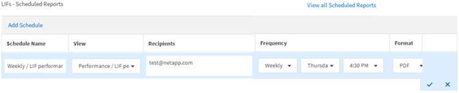

= 보고서 예약
:allow-uri-read: 
:icons: font
:imagesdir: ../media/

[role="lead"]
정기 생성 및 배포를 예약할 보기 또는 Excel 파일이 있는 경우 보고서를 예약할 수 있습니다.

* 필요한 것 *

* 애플리케이션 관리자 또는 스토리지 관리자 역할이 있어야 합니다.
* 보고 엔진이 Unified Manager 서버의 수신자 목록에 전자 메일 첨부 파일로 보고서를 보낼 수 있도록 * 일반 * > * 알림 * 페이지에서 SMTP 서버 설정을 구성해야 합니다.
* 생성된 이메일과 함께 첨부 파일을 전송할 수 있도록 이메일 서버를 구성해야 합니다.

다음 단계를 사용하여 보기에 대해 생성할 보고서를 테스트하고 예약할 수 있습니다. 사용할 보기를 선택하거나 사용자 지정합니다. 다음 절차에서는 네트워크 인터페이스의 성능을 보여 주는 네트워크 보기를 사용하지만 원하는 보기를 사용할 수 있습니다.

.단계
. 보기를 엽니다. 이 예에서는 LIF 성능을 나타내는 기본 네트워크 보기를 사용합니다. 왼쪽 탐색 창에서 * 네트워크 > 네트워크 인터페이스 * 를 클릭합니다.
. 기본 제공 Unified Manager 기능을 사용하여 필요에 따라 뷰를 사용자 지정합니다.
. 보기를 사용자 지정한 후 * 보기 * 필드에 고유한 이름을 입력하고 확인 표시를 클릭하여 저장할 수 있습니다.
+
image::../media/view_save.gif[보기를 저장하는 방법을 보여 주는 UI 스크린샷입니다.]

. Microsoft ® Excel의 고급 기능을 사용하여 보고서를 사용자 지정할 수 있습니다. 자세한 내용은 을 참조하십시오 link:task_use_excel_to_customize_your_report.html["Excel을 사용하여 보고서를 사용자 지정합니다"].
. 예약 또는 공유하기 전에 출력을 보려면:
+
[cols="2*"]
|===
| 옵션을 선택합니다 | 설명 

 a| 
* Excel을 사용하여 보고서를 사용자 지정한 경우 *
 a| 
다운로드한 기존 Excel 파일을 봅니다.

 a| 
* Excel을 사용하여 보고서를 사용자 정의하지 않은 경우 *
 a| 
보고서를 * CSV *, * PDF * 또는 * XLSX * 파일로 다운로드합니다.

|===
+
Microsoft Excel(CSV/XSLX) 또는 Adobe Acrobat(PDF)과 같은 설치된 응용 프로그램으로 파일을 엽니다.

. 보고서에 만족하면 * Scheduled Reports * 를 클릭합니다.
. 보고서 일정 페이지에서 * 일정 추가 * 를 클릭합니다.
. 뷰 이름과 빈도의 조합인 기본 이름을 그대로 사용하거나 * 스케줄 이름 * 을 사용자 정의합니다.
. 예약된 보고서를 처음으로 테스트하려면 자신을 * 받는 사람 * 으로만 추가하십시오. 만족하면 모든 보고서 수신자에 대한 이메일 주소를 추가합니다.
. 보고서를 생성하고 수신자에게 보내는 빈도를 지정합니다. Daily *, * Weekly * 또는 * Monthly * 를 선택할 수 있습니다.
. PDF *, * CSV * 또는 * XSLX * 형식으로 형식을 선택합니다.
+
[NOTE]
====
Excel을 사용하여 콘텐츠를 사용자 지정한 보고서의 경우 항상 * XSLX * 를 선택합니다.

====
. 확인 표시(image:../media/blue_check.gif[""])를 클릭하여 보고서 일정을 저장합니다.
+

+
보고서가 즉시 테스트로 전송됩니다. 그런 다음 예약된 빈도를 사용하여 나열된 수신자에게 보고서를 생성하고 e-메일로 보냅니다.

